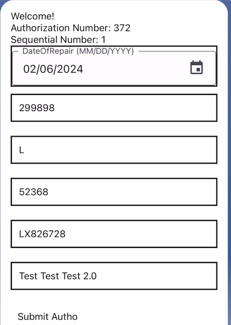

# Online Autho App

This is an Authorization App built using React-Native. The app allows users to register their name and Authorization Number, log in, then fill out an authorization form that is directly sent to the back-end.

## Table of Contents

- [Screenshots](#screenshots)
- [Features](#features)
- [Prerequisites](#prerequisites)
- [Technologies](#technologies)
- [Installation](#installation)
- [Usage](#usage)
- [Contributing](#contributing)
- [License](#license)

## Screenshots

    

## Features:
 - Registration and Logging in
 - Filling out forms that is directly sent to a database
 - Required fields automatically block a form from being sent out even after submitting.

## Prerequisites
To run this App, you need react-native, Expo Go, or a mobile emulator. 

## Technologies
* React
* React-Native
* Firebase / Firestore
* Linear-Gradient
* Expo / Expo Go

### Installation
1. Clone or download the repository to your local machine.
2. install all dependencies
3. run npm start or expo start
4. find it on expo go.

### Usage
1. After opening up the app, you will be greeted with the Start screen.
2. Either log-in with your existing account or Register
3. Fill out your forms, making sure all required fields are entered,
4. Submit!

### Contributing

Contributions to this Online Autho App are welcome! If you have any suggestions, bug fixes, or feature enhancements, feel free to open an issue or submit a pull request.

Before contributing, please review the [Code of Conduct](CODE_OF_CONDUCT.md).

## License

Online Autho App is an open-source software licensed under the [MIT License](LICENSE).